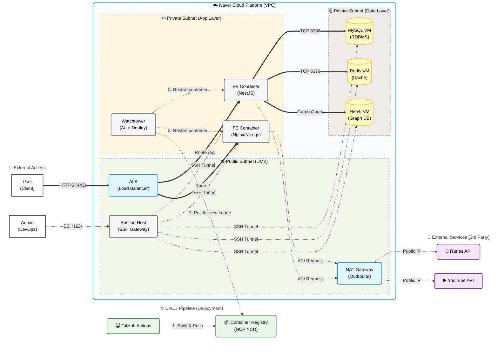

<p align="center">
  
</p>

<p align="center">
  <b>VIBE + RESONANCE</b><br/>
  <sub>알고리즘의 편향에서 벗어난 <b>사람(Human) 기반</b> 소셜 뮤직 큐레이션 플랫폼</sub>
</p>

<p align="center">
  
  
  
  
</p>

---

## 🎧 사람 중심의 음악 취향 공유 공간, VIBR

> **"Vibe"**(분위기) + **"Resonance"**(공명) — 음악으로 나를 표현하고 타인의 취향을 탐험하는 소셜 뮤직 큐레이션 플랫폼입니다.

- 🤝 알고리즘의 장르적 유사성이 아니라 **사람과 사람의 관계**(팔로우·좋아요)로 음악을 추천합니다.
- 🔗 "링크 공유"로 끝나던 추천을 한 화면에서 이어지는 **[추천 → 재생 → 반응]** 흐름으로 만듭니다.
- 🎶 Spotify·YouTube·iTunes 등 **플랫폼이 달라도** 누구나 같은 화면에서 바로 재생할 수 있습니다.

자세한 내용은 [서비스 기획서](https://github.com/boostcampwm2025/web17-Busy/wiki/%EC%84%9C%EB%B9%84%EC%8A%A4-%EA%B8%B0%ED%9A%8D%EC%84%9C)를 참고해주세요.

---

## 서비스 실제 사용 화면


---

## 💻 로컬 Setup

### Requirements

- **Node.js >= 18** (권장: LTS)
- **pnpm** (workspace 기준)

### Install

```bash
corepack enable
pnpm -v
pnpm install
```

### Run Database

```bash
docker compose up -d
```

### Run Dev

```bash
pnpm dto # FE/BE 공통 dto 패키지 빌드
pnpm dev # 개발 서버 전체 실행 (web + api)
```

### 그 외 스크립트 명령어

```bash
pnpm lint
pnpm check-types
pnpm build
pnpm format
```

<br>

## 🛠 기술 스택

| 영역               | 스택                                                                                                                                                                                                                                                                                                                                                                                                                                                                                                                                |
| ------------------ | ----------------------------------------------------------------------------------------------------------------------------------------------------------------------------------------------------------------------------------------------------------------------------------------------------------------------------------------------------------------------------------------------------------------------------------------------------------------------------------------------------------------------------------- |
| **Frontend**       |                                                                                                                                                                                                                              |
| **Backend**        |      |
| **Common**         |                                                                                                                                                                                                                                                                                                              |
| **Environment**    |   -F05032.svg?style=flat-square&logo=git&logoColor=white>)                                                                                      |
| **Infrastructure** |                                                                                                                                                   |

<br>

## ☁️ 인프라 아키텍처



> 위 다이어그램은 원래 설계된 배포 아키텍처를 옮긴 것입니다. **현재는 대상 인프라가 없어** 배포·트리거 워크플로우(`deploy.yml`, `ecsTrigger.yml`)는 수동 실행(`workflow_dispatch`)으로 전환된 상태이며, CI(`ci.yml`)만 push/PR 시 자동 실행됩니다.

자세한 내용은 [배포/인프라 설계서](https://github.com/boostcampwm2025/web17-Busy/wiki/%EB%B0%B0%ED%8F%AC---%EC%9D%B8%ED%94%84%EB%9D%BC)를 참고해주세요.

---

## 🔧 지금까지 해결한 문제들

기능 개발 이후에도 구조적 문제를 진단하고 개선하는 리팩터링을 이어가고 있습니다. 각 항목은 진단(PRD) → 설계(ADR) → 구현 → 결과 검증 과정을 거쳤고, 상세 기록은 `docs/refactors/`에 남아있습니다.

| 문제 영역                   | 무엇을 해결했나                                                                                                                                                                                              | PR                                                                     |
| --------------------------- | ------------------------------------------------------------------------------------------------------------------------------------------------------------------------------------------------------------ | ---------------------------------------------------------------------- |
| 서버 상태 캐싱              | 플레이리스트·로그인정보·게시글상세를 화면마다 따로 `useState`+`useEffect`로 캐싱해, 한 화면에서 바꾼 데이터가 다른 화면에 반영되지 않는 캐시 불일치가 있었음 → TanStack Query 도입으로 캐시 공유·자동 무효화 | [#148](https://github.com/Jae-Hyuk-Jang/web17-boostcamp-vibr/pull/148) |
| 버튼 disabled 스타일 중복   | 버튼 `disabled` 클래스 조합이 파일마다 반복 → 공유 상수로 통일                                                                                                                                               | [#138](https://github.com/Jae-Hyuk-Jang/web17-boostcamp-vibr/pull/138) |
| 로그인 버튼 중복            | 로그인 버튼 3종이 각자 구현됨 → `LoginActionButton`으로 통일                                                                                                                                                 | [#136](https://github.com/Jae-Hyuk-Jang/web17-boostcamp-vibr/pull/136) |
| 게시글 상세 모달 책임 분리  | 상세 모달(329줄)이 데이터 조합·플레이어 연동·라우팅 전환·편집·UX 로그·스와이프까지 7가지 책임을 한 컴포넌트가 전담 → 오케스트레이션 훅 + 서브컴포넌트로 분리(69줄)                                           | [#134](https://github.com/Jae-Hyuk-Jang/web17-boostcamp-vibr/pull/134) |
| 모바일 재생목록 진입점 중복 | 모바일에서 재생목록을 여는 진입점이 2개 있고 각각 다른 화면으로 연결됨 → 단일 진입점으로 통합                                                                                                                | [#123](https://github.com/Jae-Hyuk-Jang/web17-boostcamp-vibr/pull/123) |
| 검색 위젯 중복              | 검색창+탭 전환+상태 메시지+결과 렌더링을 화면마다 재구현 → `MusicPickerSearch` 공용 컴포넌트로 통합                                                                                                          | [#116](https://github.com/Jae-Hyuk-Jang/web17-boostcamp-vibr/pull/116) |
| 공유 컴포넌트/버튼 중복     | 공유 `Button`이 없어 화면마다 스타일을 인라인으로 반복, 공용 컴포넌트가 도메인 폴더와 뒤섞여 있었음 → 공용 `Button` 도입 + `components/ui/` 정리                                                             | [#109](https://github.com/Jae-Hyuk-Jang/web17-boostcamp-vibr/pull/109) |
| 모달 구조/순환참조          | 모달 8개의 구조·관계가 파악되어 있지 않고 순환참조가 존재 → 배럴 구조 정리, 순환참조 제거                                                                                                                    | [#94](https://github.com/Jae-Hyuk-Jang/web17-boostcamp-vibr/pull/94)   |
| 모달 배경/닫기 동작 중복    | 모달 8개가 배경 오버레이·배경 클릭 닫기·z-index·닫기 버튼을 각자 구현 → 공용 `ModalShell`/`ModalCloseButton` 도입                                                                                            | [#78](https://github.com/Jae-Hyuk-Jang/web17-boostcamp-vibr/pull/78)   |
| 게시글 상세 UX 로그 분리    | 상세 모달이 좋아요/댓글 반응 외에 체류시간·재생곡 추적 같은 UX 로그 수집까지 겸함 → `usePostDetailUxLog` 훅으로 분리                                                                                         | [#63](https://github.com/Jae-Hyuk-Jang/web17-boostcamp-vibr/pull/63)   |
| 좋아요/댓글 반응 상태 중복  | 좋아요 낙관적 갱신+롤백 로직이 `PostCard`와 `usePostReactions` 두 곳에 독립 구현 → `usePostLikeToggle`로 합성                                                                                                | [#52](https://github.com/Jae-Hyuk-Jang/web17-boostcamp-vibr/pull/52)   |

진행 중이거나 검토 대기 중인 항목은 [`backlog` 라벨이 붙은 이슈](https://github.com/Jae-Hyuk-Jang/web17-boostcamp-vibr/issues?q=is%3Aissue+is%3Aopen+label%3Abacklog)에서 볼 수 있습니다.

---

## 🌟 팀원 소개

|                        J048 김승호                         |                        J055 김예빈                        |                       J100 문예찬                       |                          J237 장재혁                          |
| :--------------------------------------------------------: | :-------------------------------------------------------: | :-----------------------------------------------------: | :-----------------------------------------------------------: |
|  |  |  |  |
|           **J048&nbsp;김승호**<br/>Seung-Ho Kim            |            **J055&nbsp;김예빈**<br/>Ye-Bin Kim            |          **J100&nbsp;문예찬**<br/>Ye-Chan Moon          |            **J237&nbsp;장재혁**<br/>Jae-Hyuk Jang             |
|        [seunghok22](https://github.com/seunghok22)         |         [yebinGold](https://github.com/yebinGold)         |          [myc0603](https://github.com/myc0603)          |       [Jae-Hyuk-Jang](https://github.com/Jae-Hyuk-Jang)       |
